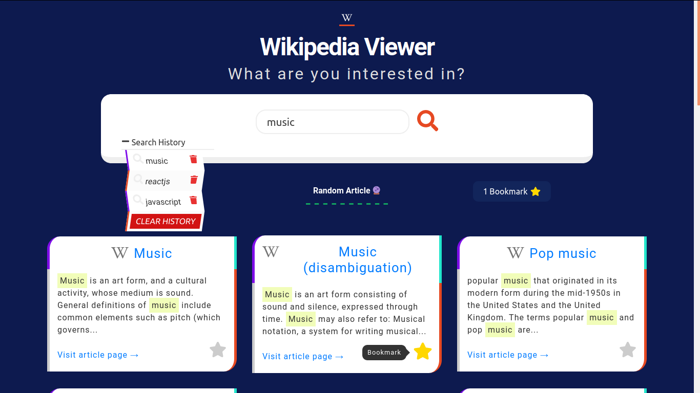
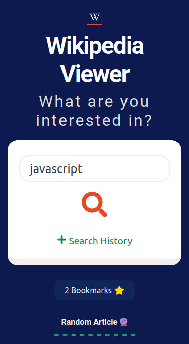
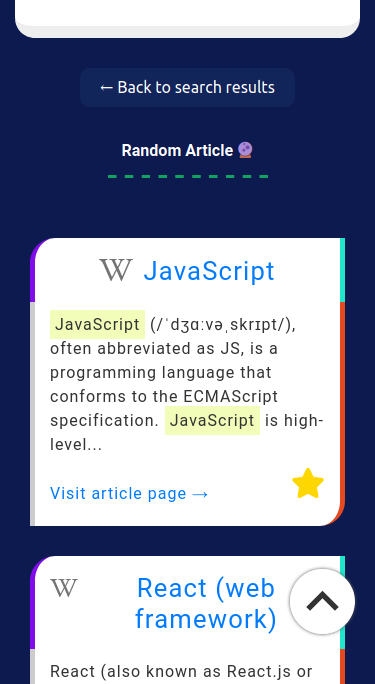

# 🔍 Wikipedia Viewer

A simple Wikipedia snippet viewer utilizing Wikipedia's [Search API](https://www.mediawiki.org/wiki/API:Search) for querying articles.

**Some of the features include**:

- Bookmarks
- Search History
- Random Article Link

Search history and bookmark data persist (and can be cleared) as it is stored in localStorage.\
The app state is managed using custom hooks: `useWikiSearch`, `useBookmarks` and `useSearchHistory`.

## Demo

### ✨ [View Live Demo](https://wikipedia-snippet-viewer.netlify.app)

### Screens

<p align="center">
    
</p>

## Dependencies

- [React](https://reactjs.org)
- [Styled Components](https://styled-components.com)
- [React Icons](https://react-icons.github.io)
- [axios](https://github.com/axios/axios)
- [PropTypes](https://www.npmjs.com/package/prop-types)

## Installation

```console
git clone https://github.com/orrsteinberg/wikipedia-viewer.git
cd wikipedia-viewer
npm install
npm start
```

Visit `http://localhost:3000`.
